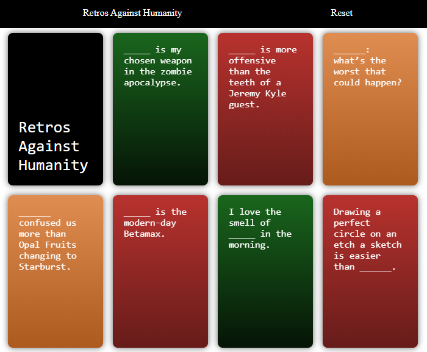

# Cards Against Humanity card deck for Retrospectives
Original idea from [here](https://www.boxuk.com/insight/retros-against-humanity/)

Card flip animation in this [fiddle](https://codepen.io/101Computing/pen/GbOJmE)

## Libraies used:
seedrandom.js by David Bau, which is licensed under MIT
