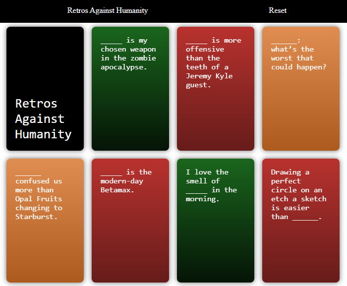

# Cards Against Humanity card deck for Retrospectives
Original idea from [BoxUk](https://www.boxuk.com/insight/retros-against-humanity/)
Additional rules and cards from [Cards for Agility](https://lithespeed.com/cards-for-agility/)

Card flip animation in this [fiddle](https://codepen.io/101Computing/pen/GbOJmE)

## New Features ✨

### P2P Sync (Decentralized Multiplayer)
- **Real-time synchronization** between multiple browsers without a server
- **Random animal usernames** for each participant (Cat, Dog, Unicorn, etc.)
- **Room-based connections** for easy group sessions
- **Instant card flip sync** across all connected users

[📖 Read the P2P Sync Guide](./P2P_SYNC_GUIDE.md)

## Libraries used:
- seedrandom.js by David Bau, which is licensed under MIT
- PeerJS for WebRTC peer-to-peer connections
